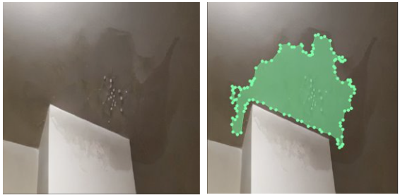
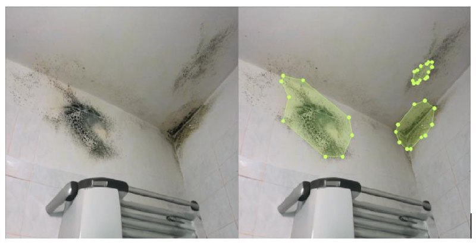
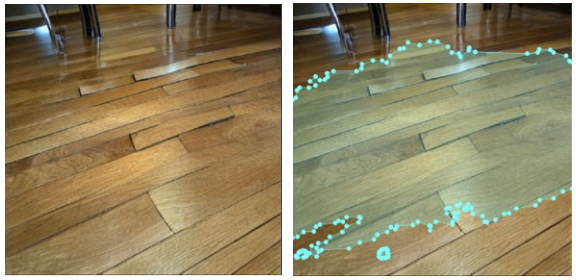

**Project Context**  
This project was developed for an **insurance company** specializing in assessing and preventing **wet damage** in properties. The generated image–mask dataset simulates realistic water intrusion scenarios (e.g., pipe leaks, flooding, ceiling seepage) along with precise segmentation masks, enabling more accurate and automated damage detection in visual inspection systems.

**Generated image + mask examples:** 

   
  <em>Figure 1: The water drip created a bubbling effect on the white ceiling paint.</em>  
   
    <em>Figure 2: on the wall in this bathroom, dark mold is growing .</em>  
   
    <em>Figure 3: on the hardwood floor there is a patch of lifted tiles.</em>  

## High-Resolution Synthetic Image–Mask Dataset Generation

Developed a **prompt-driven, high-resolution synthetic image–mask dataset** by training a **guided latent diffusion model** that integrates:

- **Variational Autoencoder (VAE)** — for encoding images into a compact latent space, enabling efficient representation and reconstruction.
- **Denoising Diffusion Probabilistic Model (DDPM)** — for progressive denoising from pure noise to generate realistic image–mask pairs.
- **Classifier-Free Guidance** — to improve prompt alignment and semantic accuracy without the need for explicit classifier models.
- **DDIM Sampling** — for accelerated inference, achieving faster generation without sacrificing image quality.

### Key Contributions & Techniques
- **Text-to-Image–Mask Generation**: Leveraged natural language prompts to control both image content and corresponding segmentation masks.
- **Guidance-Enhanced Fidelity**: Tuned classifier-free guidance weights to balance creativity and precision in the generated outputs.
- **Performance-Oriented Sampling**: Implemented **DDIM** sampling to reduce generation time while maintaining high perceptual quality.
- **Dataset Tailored for Segmentation**: Designed synthetic masks to align tightly with object boundaries, aiding segmentation model training.

### Results
- **Improved Intersection over Union (IoU)** scores across multiple object categories.
- Class-specific performance gains, **up to 10% IoU improvement** in certain categories.
- Consistent high-resolution outputs suitable for training state-of-the-art segmentation architectures.

### Potential Applications
- Data augmentation for **semantic segmentation** in low-data regimes.
- Benchmarking for vision-language segmentation models.
- Rapid prototyping of new segmentation architectures.

---
*This work demonstrates the effectiveness of combining latent diffusion with guided sampling strategies to produce high-fidelity, prompt-aligned synthetic datasets for computer vision research.*
